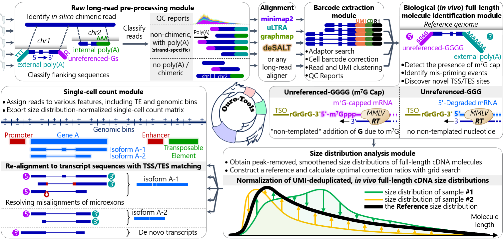

# Ouro-Tools

Ouro-Tools is a novel computational pipeline for long-read scRNA-seq with the following key features. Ouro-Tools **(1) normalizes mRNA size distributions** and **(2) detects mRNA 7-methylguanosine caps** to integrate multiple single-cell long-read RNA-sequencing experiments across modalities and characterize full-length transcripts, respectively.


## Introduction




## Installation 

The latest stable version of Ouro-Tools is available via https://pypi.org/

In order to install the latest, unreleased version of Ouro-Tools, run the following commands in bash shell.

```bash
git clone https://github.com/ahs2202/ouro-tools.git
cd ouro-tools
pip install .
```


Ouro-Tools can be used in command line, in a Python script, or in an interactive Python interpreter (e.g., Jupyter Notebook).

### Bash shell

To print the command line usage example of each module from the bash shell, please type the following command.

```bash
ourotools LongFilterNSplit -h
```


### Python script

```python
#run 
import ourotools
if __name__ == '__main__' : # protect the entry point (important!)

```

### IPython environment

Detailed arguments and the docstring can be printed in IPython environment.

```python
ourotools.LongFilterNSplit?
```


## Building an index for Ouro-Tools' single-cell count module

Single-cell count module of Ouro-Tools utilizes <u>genome, transcriptome, and gene annotations</u> to assign reads to **genes, isoforms, and genomic bins (tiles across the genome)**. The index building process is automatic; <u>there is no needs to run a separate command in order to build the index</u>. Once Ouro-Tools processes these information before analyzing an input BAM file(s), the program saves an index in order to load the information much faster next time.

We recommends using <u>***Ensembl*** reference genome, transcriptome, and gene annotations of the same version</u> (release number). 


### Pre-build index files 

pre-built index can be downloaded using the following links (should be extracted to a folder using **tar -xf** command):

<u>*Human (GRCh38, Ensembl version 105)*</u> : https://ouro-tools.s3.amazonaws.com/index/latest/Homo_sapiens.GRCh38.105.v0.2.4.tar

*<u>Mouse (GRCm38, Ensembl version 102)</u>* : https://ouro-tools.s3.amazonaws.com/index/latest/Mus_musculus.GRCm38.102.v0.2.4.tar

<u>*Zebrafish (GRCz11, Ensembl version 104)*</u> : https://ouro-tools.s3.amazonaws.com/index/latest/Danio_rerio.GRCz11.104.v0.2.4.tar

*<u>Thale cress (TAIR10, Ensembl Plant version 56)</u>* : https://ouro-tools.s3.amazonaws.com/index/latest/Arabidopsis_thaliana.TAIR10.56.v0.2.4.tar


### Building index from scratch

An Ouro-Tools index can be built on-the-fly from the input genome, transcriptome, and gene annotation files. For example, below are the list of files that were used for the pre-built Ouro-Tools index "<u>*[Human (GRCh38, Ensembl version 105)](https://www.dropbox.com/s/8agizrykiorpnag/Homo_sapiens.GRCh38.105.v0.1.1.tar?dl=0)*</u>".


*required annotations* (*Ensemble version 105*):

* **path_file_fa_genome** : https://ftp.ensembl.org/pub/release-105/fasta/homo_sapiens/dna/Homo_sapiens.GRCh38.dna.primary_assembly.fa.gz
  * A genome FASTA file. Either gzipped or plain FASTA file can be accepted.
* **path_file_gtf_genome** :  https://ftp.ensembl.org/pub/release-105/gtf/homo_sapiens/Homo_sapiens.GRCh38.105.gtf.gz
  * A GTF file. Either gzipped or plain GTF file can be accepted. Currently GFF3 format files are not supported.
  * Following arguments can be used to set attribute names for identifying gene and transcript annotations in its attributes column.
    * str_name_gtf_attr_for_id_gene : (default: '**gene_id**')
    * str_name_gtf_attr_for_name_gene : (default: '**gene_name**')
    * str_name_gtf_attr_for_id_transcript : (default: '**transcript_id**')
    * str_name_gtf_attr_for_name_transcript : (default: '**transcript_name**')
  * An example of GTF annotation file for gene annotations:

```
1	ensembl_havana	gene	1211340	1214153	.	-	.	gene_id "ENSG00000186827"; gene_version "11"; gene_name "TNFRSF4"; gene_source "ensembl_havana"; gene_biotype "protein_coding";
1	ensembl_havana	transcript	1211340	1214153	.	-	.	gene_id "ENSG00000186827"; gene_version "11"; transcript_id "ENST00000379236"; transcript_version "4"; gene_name "TNFRSF4"; gene_source "ensembl_havana"; gene_biotype "protein_coding"; transcript_name "TNFRSF4-201"; transcript_source "ensembl_havana"; transcript_biotype "protein_coding"; tag "CCDS"; ccds_id "CCDS11"; tag "basic"; transcript_support_level "1 (assigned to previous version 3)";
1	ensembl_havana	exon	1213983	1214153	.	-	.	gene_id "ENSG00000186827"; gene_version "11"; transcript_id "ENST00000379236"; transcript_version "4"; exon_number "1"; gene_name "TNFRSF4"; gene_source "ensembl_havana"; gene_biotype "protein_coding"; transcript_name "TNFRSF4-201"; transcript_source "ensembl_havana"; transcript_biotype "protein_coding"; tag "CCDS"; ccds_id "CCDS11"; exon_id "ENSE00001832731"; exon_version "2"; tag "basic"; transcript_support_level "1 (assigned to previous version 3)";
```

* **path_file_fa_transcriptome** : https://ftp.ensembl.org/pub/release-105/fasta/homo_sapiens/cdna/Homo_sapiens.GRCh38.cdna.all.fa.gz
  * A transcriptome FASTA file. Either gzipped or plain FASTA file can be accepted.


*optional annotations:*

* **path_file_tsv_repeatmasker_ucsc** : [Table Browser (ucsc.edu)](https://genome.ucsc.edu/cgi-bin/hgTables?hgsid=1576143313_LetmEyQf9yggiQJAXajCua4TGOGl&clade=mammal&org=Human&db=hg38&hgta_group=rep&hgta_track=knownGene&hgta_table=0&hgta_regionType=genome&position=chr2%3A25%2C160%2C915-25%2C168%2C903&hgta_outputType=primaryTable&hgta_outFileName=GRCh38_RepeatMasker.tsv.gz) [click "get output" to download the annotation]

  * repeat masker annotations from the UCSC Table Browser

* **path_file_gff_regulatory_element** : https://ftp.ensembl.org/pub/current_regulation/homo_sapiens/homo_sapiens.GRCh38.Regulatory_Build.regulatory_features.20221007.gff.gz

  * The latest regulatory build from **Ensembl**.
  * Annotations from other sources, or custom annotations can be used. Currently only the GFF3 file format is supported (with **.gff** extension).
  * The following argument can be used to set the attribute name for identifying regulatory region
    * str_name_gff_attr_id_regulatory_element : (default: '**ID**')

  * An example of GFF annotation file for regulatory elements:

```
18	Regulatory_Build	enhancer	35116801	35120999	.	.	.	ID=enhancer:ENSR00000572865;bound_end=35120999;bound_start=35116801;description=Predicted enhancer region;feature_type=Enhancer
8	Regulatory_Build	TF_binding_site	37967115	37967453	.	.	.	ID=TF_binding_site:ENSR00001137252;bound_end=37967531;bound_start=37966339;description=Transcription factor binding site;feature_typ
6	Regulatory_Build	enhancer	90249202	90257999	.	.	.	ID=enhancer:ENSR00000798348;bound_end=90257999;bound_start=90249202;description=Predicted enhancer region;feature_type=Enhancer
3	Regulatory_Build	CTCF_binding_site	57689401	57689600	.	.	.	ID=CTCF_binding_site:ENSR00000687477;bound_end=57689600;bound_start=57689401;description=CTCF binding site;feature_type=CTCF
```


## Running the Ouro-Tools in a Python script (with examples)

```python
#run Ouro-Tools 


```


---------------

Ouro-Tools was developed by Hyunsu An and Chaemin Lim at Gwangju Institute of Science and Technology under the supervision of Professor Jihwan Park. 

© 2024 Functional Genomics Lab, Gwangju Institute of Science and Technology
