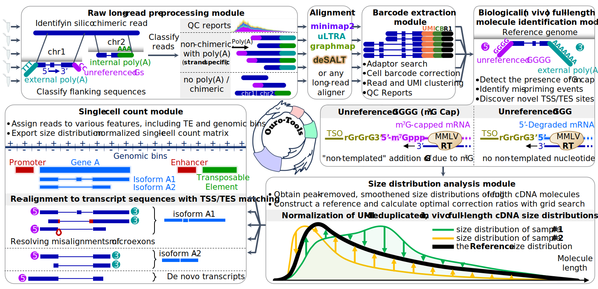

<h1 align="center">
  <a href="https://github.com/ahs2202/ouro-tools"></a>
  <br><br>
  <a href="https://github.com/ahs2202/ouro-tools">Ouro-Tools</a> - <em>long-read scRNA-seq</em> toolkit
</h1>

Ouro-Tools is a novel, comprehensive computational pipeline for long-read scRNA-seq with the following key features. Ouro-Tools **(1) normalizes mRNA size distributions** and **(2) detects mRNA 7-methylguanosine caps** to integrate multiple single-cell long-read RNA-sequencing experiments across modalities and characterize full-length transcripts, respectively.

<p align="center">
  <a href="https://github.com/ahs2202/ouro-tools"></a>
</p>


## Table of Contents

- [Table of Contents](#table-of-contents)

 - [Introduction](#introduction)
   
   - [What is long-read scRNA-seq?](#what-is-long-read-scRNA-seq)
   
 - [Installation](#installation)

 - [Before starting the tutorial](#before-start)

   - [Download our *toy* long-read scRNA-seq datasets](#toy-datasets)
   - [Basic settings for running the entire pipeline](#basic-settings)

 - [*step 1)* Raw long-read pre-processing module](#preprocessing)

 - [*step 2)* Spliced alignment](#alignment)

 - [*step 3)* Barcode extraction module](#barcode-extraction)

 - [*step 4)* Biological full-length molecule identification module](#full-length-ID)

 - [*step 5)* Size distribution normalization module](#size-normalization)

 - [*step 6)* Single-cell count module](#single-cell-count-module)

   - [Building an index for the single-cell count module](#count-module-index)
     - [Pre-built index](#pre-built-index)
     - [Building index from scratch](#building-index)
     - [*optional input annotations*](#optional-input-annotations)

 - [*step 7)* Visualization](#visualization)

      


## Introduction <a name="introduction"></a>


### What is long-read scRNA-seq? <a name="what-is-long-read-scRNA-seq"></a>


## Installation <a name="installation"></a>

The latest stable version of Ouro-Tools is available via https://pypi.org/

In order to install the latest, unreleased version of Ouro-Tools, run the following commands in bash shell.

```bash
git clone https://github.com/ahs2202/ouro-tools.git
cd ouro-tools
pip install .
```


Ouro-Tools can be used in command line, in a Python script, or in an interactive Python interpreter (e.g., Jupyter Notebook).

To print the command line usage example of each module from the bash shell, please type the following command.


**Bash shell**

```bash
ourotools LongFilterNSplit -h
```

**IPython environment (Jupyter notebook)**

```python
ourotools.LongFilterNSplit?
```


## Before starting the tutorial<a name="before-start"></a>


### Download our *toy* long-read scRNA-seq datasets <a name="toy-datasets"></a>

```bash
# download toy datasets from mouse ovary and testis
wget https://ouro-tools.s3.amazonaws.com/tutorial/mOvary.subsampled.fastq.gz
wget https://ouro-tools.s3.amazonaws.com/tutorial/mTestis2.subsampled.fastq.gz 
```

Alternatively, you can download directly using your browser using the following links: [mOvary](https://ouro-tools.s3.amazonaws.com/tutorial/mOvary.subsampled.fastq.gz) and [mTestis](https://ouro-tools.s3.amazonaws.com/tutorial/mTestis2.subsampled.fastq.gz )


### Basic settings for running the entire pipeline<a name="basic-settings"></a>

```python
import ourotools


# global multiprocessing settings
ourotools.bk.int_max_num_batches_in_a_queue_for_each_worker = 1
n_workers = 2 # employ 2 workers (since there are two samples, 2 workers are sufficient)
n_threads_for_each_worker = 8 # use 8 CPU cores for each worker


# datasets-specific setting
path_folder_data = '/home/project/Single_Cell_Full_Length_Atlas/data/pipeline/20220331_Ouroboros_Project/pipeline/20230208_Mouse_Long_Read_Single_Cell_Atlas/pipeline/20230811_mouse_long_read_single_cell_atlas_v202308/tutorial_data/20240728_ovary_testis_tutorial/'
l_name_sample = [
    'mOvary.subsampled',
    'mTestis2.subsampled',
]


# scRNA-seq technology-specific settings
path_file_valid_barcode_list = '/home/project/Single_Cell_Full_Length_Atlas/data/pipeline/20210728_development_ouroboros_qc/example/3M-february-2018.txt.gz' # GEX v3 CB


# species-specific settings
path_file_minimap_index_genome = '/home/shared/ensembl/Mus_musculus/index/minimap2/Mus_musculus.GRCm38.dna.primary_assembly.k_14.idx'
path_file_minimap_splice_junction = '/home/shared/ensembl/Mus_musculus/Mus_musculus.GRCm38.102.paftools.bed'
path_file_minimap_unwanted = '/home/project/Single_Cell_Full_Length_Atlas/data/accessory_data/cDNA_depletion/index/minimap2/MT_and_rRNA_GRCm38.fa.ont.mmi'
```


## *step 1)* Raw long-read pre-processing module <a name="preprocessing"></a>

```python
# run LongFilterNSplit
ourotools.LongFilterNSplit(
    path_file_minimap_index_genome = path_file_minimap_index_genome,
    l_path_file_minimap_index_unwanted = [ path_file_minimap_unwanted ],
    l_path_file_fastq_input = list( f"{path_folder_data}{name_sample}.fastq.gz" for name_sample in l_name_sample ),
    l_path_folder_output = list( f"{path_folder_data}LongFilterNSplit_out/{name_sample}/" for name_sample in l_name_sample ),
    int_num_samples_analyzed_concurrently = n_workers,
    n_threads = n_workers * n_threads_for_each_worker,
)
```


## *step 2)* Spliced alignment <a name="alignment"></a>

Alignment using *Minimap2*

```python
# align using minimap2 (require that minimap2 executable can be found in PATH)
# below is a wrapper function for minimap2
ourotools.Workers(
    ourotools.ONT.Minimap2_Align, # function to deploy
    int_num_workers_for_Workers = n_workers, # create 'n_workers' number of workers
    # below are arguments for the function 'ourotools.ONT.Minimap2_Align'
    path_file_fastq = list( f"{path_folder_data}LongFilterNSplit_out/{name_sample}/aligned_to_genome__non_chimeric__poly_A__plus_strand.fastq.gz" for name_sample in l_name_sample ), 
    path_folder_minimap2_output = list( f"{path_folder_data}minimap2_bam_genome/{name_sample}/" for name_sample in l_name_sample ), 
    path_file_junc_bed = path_file_minimap_splice_junction, 
    path_file_minimap2_index = path_file_minimap_index_genome,
    n_threads = n_threads_for_each_worker,
)
```


## *step 3)* Barcode extraction module <a name="barcode-extraction"></a>

```python
# run LongExtractBarcodeFromBAM
l_path_folder_barcodedbam = list( f"{path_folder_data}LongExtractBarcodeFromBAM_out/{name_sample}/" for name_sample in l_name_sample )
ourotools.LongExtractBarcodeFromBAM(
    path_file_valid_cb = path_file_valid_barcode_list,
    l_path_file_bam_input = list( f"{path_folder_data}minimap2_bam_genome/{name_sample}/aligned_to_genome__non_chimeric__poly_A__plus_strand.fastq.gz.minimap2_aligned.bam" for name_sample in l_name_sample ), 
    l_path_folder_output = l_path_folder_barcodedbam,
    int_num_samples_analyzed_concurrently = n_workers, 
    n_threads = n_workers * n_threads_for_each_worker,
)
```


## *step 4)* Biological full-length molecule identification module <a name="full-length-ID"></a>

```python
# run full-length ID module
# survey 5' sites for each sample
ourotools.LongSurvey5pSiteFromBAM(
    l_path_folder_input = l_path_folder_barcodedbam,
    int_num_samples_analyzed_concurrently = n_workers, 
    n_threads = n_workers * n_threads_for_each_worker,
)
# combine 5' site profiles across samples and classify each 5' profile
ourotools.LongClassify5pSiteProfiles( 
    l_path_folder_input = l_path_folder_barcodedbam,
    path_folder_output = f"{path_folder_data}LongClassify5pSiteProfiles_out/",
    # weight for classifier
    path_file_dict_weight = {
        'l_label' : [ '0_GGGG', '0_GGG', '-1_GGGG', '-1_GGG', '-2_GGGG', '-2_GGG', 'no_unrefG', ],
        'mtx' : [ 
            [ 0, 0.5, 0.5, 1.0,  2.0,   -1, -1 ],
            [ 0,  -1,  -3,   2,   -2,   -1, -1 ],
            [ 0, 0.5, 1.0, 2.0, -2.0, -1.0, -1 ],
            [ 0,  -3,   2,  -2,   -1,   -1, -1 ],
            [ 0,   1,   2,  -2,   -1,   -1, -1 ],
            [ 0,   2,  -2,  -1,   -1,   -1, -1 ],
            [ 1,  -1,  -3,  -5,  -10,   -1, -1 ],
        ],
    },
    n_threads = n_threads_for_each_worker,
)
# append 5' site classification results to each BAM file
ourotools.LongAdd5pSiteClassificationResultToBAM(
    path_folder_input_5p_sites = f'{path_folder_data}LongClassify5pSiteProfiles_out/',
    l_path_folder_input_barcodedbam = l_path_folder_barcodedbam,
    int_num_samples_analyzed_concurrently = n_workers, 
    n_threads = n_workers * n_threads_for_each_worker,
)
# filter artifact reads from each BAM file
ourotools.Workers(
    ourotools.FilterArtifactReadFromBAM, # function to deploy
    int_num_workers_for_Workers = n_workers, # create 'n_workers' number of workers
    # below are arguments for the function 'ourotools.FilterArtifactReadFromBAM'
    path_file_bam_input = list( f'{path_folder_data}LongExtractBarcodeFromBAM_out/{name_sample}/5pSiteTagAdded/barcoded.bam' for name_sample in l_name_sample ), 
    path_folder_output = list( f'{path_folder_data}LongExtractBarcodeFromBAM_out/{name_sample}/5pSiteTagAdded/FilterArtifactReadFromBAM_out/' for name_sample in l_name_sample ), 
)
```


## *step 5)* Size distribution normalization module <a name="size-normalization"></a>

```python
# run mRNA size distribution normalization module
# survey the size distribution of full-length mRNAs for each sample
ourotools.Workers( 
    ourotools.LongSummarizeSizeDistributions,
    int_num_workers_for_Workers = n_workers, # create 'n_workers' number of workers
    path_file_bam_input = list( f'{path_folder_data}LongExtractBarcodeFromBAM_out/{name_sample}/5pSiteTagAdded/FilterArtifactReadFromBAM_out/valid_3p_valid_5p.bam' for name_sample in l_name_sample ),
    path_folder_output =  list( f'{path_folder_data}LongExtractBarcodeFromBAM_out/{name_sample}/5pSiteTagAdded/FilterArtifactReadFromBAM_out/valid_3p_valid_5p.LongSummarizeSizeDistributions_out/' for name_sample in l_name_sample ),
)
```


## *step 6)* Single-cell count module <a name="single-cell-count-module"></a>

```python
ourotools.LongFilterNSplit?
```


### Building an index for Ouro-Tools' single-cell count module <a name="count-module-index"></a>

Single-cell count module of Ouro-Tools utilizes <u>genome, transcriptome, and gene annotations</u> to assign reads to **genes, isoforms, and genomic bins (tiles across the genome)**. The index building process is automatic; <u>there is no needs to run a separate command in order to build the index</u>. Once Ouro-Tools processes these information before analyzing an input BAM file(s), the program saves an index in order to load the information much faster next time.

We recommends using <u>***Ensembl*** reference genome, transcriptome, and gene annotations of the same version</u> (release number). 


#### Pre-built index <a name="pre-built-index"></a>

pre-built index can be downloaded using the following links (should be extracted to a folder using **tar -xf** command):

<u>*Human (GRCh38, Ensembl version 105)*</u> : https://ouro-tools.s3.amazonaws.com/index/latest/Homo_sapiens.GRCh38.105.v0.2.4.tar

*<u>Mouse (GRCm38, Ensembl version 102)</u>* : https://ouro-tools.s3.amazonaws.com/index/latest/Mus_musculus.GRCm38.102.v0.2.4.tar

<u>*Zebrafish (GRCz11, Ensembl version 104)*</u> : https://ouro-tools.s3.amazonaws.com/index/latest/Danio_rerio.GRCz11.104.v0.2.4.tar

*<u>Thale cress (TAIR10, Ensembl Plant version 56)</u>* : https://ouro-tools.s3.amazonaws.com/index/latest/Arabidopsis_thaliana.TAIR10.56.v0.2.4.tar


#### Building index from scratch <a name="building-index"></a>

An Ouro-Tools index can be built on-the-fly from the input genome, transcriptome, and gene annotation files. For example, below are the list of files that were used for the pre-built Ouro-Tools index "<u>*[Human (GRCh38, Ensembl version 105)](https://www.dropbox.com/s/8agizrykiorpnag/Homo_sapiens.GRCh38.105.v0.1.1.tar?dl=0)*</u>".


*required annotations* (*Ensemble version 105*):

* **path_file_fa_genome** : https://ftp.ensembl.org/pub/release-105/fasta/homo_sapiens/dna/Homo_sapiens.GRCh38.dna.primary_assembly.fa.gz
  * A genome FASTA file. Either gzipped or plain FASTA file can be accepted.
* **path_file_gtf_genome** :  https://ftp.ensembl.org/pub/release-105/gtf/homo_sapiens/Homo_sapiens.GRCh38.105.gtf.gz
  * A GTF file. Either gzipped or plain GTF file can be accepted. Currently GFF3 format files are not supported.
  * Following arguments can be used to set attribute names for identifying gene and transcript annotations in its attributes column.
    * str_name_gtf_attr_for_id_gene : (default: '**gene_id**')
    * str_name_gtf_attr_for_name_gene : (default: '**gene_name**')
    * str_name_gtf_attr_for_id_transcript : (default: '**transcript_id**')
    * str_name_gtf_attr_for_name_transcript : (default: '**transcript_name**')
  * An example of GTF annotation file for gene annotations:

```
1	ensembl_havana	gene	1211340	1214153	.	-	.	gene_id "ENSG00000186827"; gene_version "11"; gene_name "TNFRSF4"; gene_source "ensembl_havana"; gene_biotype "protein_coding";
1	ensembl_havana	transcript	1211340	1214153	.	-	.	gene_id "ENSG00000186827"; gene_version "11"; transcript_id "ENST00000379236"; transcript_version "4"; gene_name "TNFRSF4"; gene_source "ensembl_havana"; gene_biotype "protein_coding"; transcript_name "TNFRSF4-201"; transcript_source "ensembl_havana"; transcript_biotype "protein_coding"; tag "CCDS"; ccds_id "CCDS11"; tag "basic"; transcript_support_level "1 (assigned to previous version 3)";
1	ensembl_havana	exon	1213983	1214153	.	-	.	gene_id "ENSG00000186827"; gene_version "11"; transcript_id "ENST00000379236"; transcript_version "4"; exon_number "1"; gene_name "TNFRSF4"; gene_source "ensembl_havana"; gene_biotype "protein_coding"; transcript_name "TNFRSF4-201"; transcript_source "ensembl_havana"; transcript_biotype "protein_coding"; tag "CCDS"; ccds_id "CCDS11"; exon_id "ENSE00001832731"; exon_version "2"; tag "basic"; transcript_support_level "1 (assigned to previous version 3)";
```

* **path_file_fa_transcriptome** : https://ftp.ensembl.org/pub/release-105/fasta/homo_sapiens/cdna/Homo_sapiens.GRCh38.cdna.all.fa.gz
  * A transcriptome FASTA file. Either gzipped or plain FASTA file can be accepted.


#### *optional input annotations*  <a name="optional-input-annotations"></a>

* **path_file_tsv_repeatmasker_ucsc** : [Table Browser (ucsc.edu)](https://genome.ucsc.edu/cgi-bin/hgTables?hgsid=1576143313_LetmEyQf9yggiQJAXajCua4TGOGl&clade=mammal&org=Human&db=hg38&hgta_group=rep&hgta_track=knownGene&hgta_table=0&hgta_regionType=genome&position=chr2%3A25%2C160%2C915-25%2C168%2C903&hgta_outputType=primaryTable&hgta_outFileName=GRCh38_RepeatMasker.tsv.gz) [click "get output" to download the annotation]

  * repeat masker annotations from the UCSC Table Browser

* **path_file_gff_regulatory_element** : https://ftp.ensembl.org/pub/current_regulation/homo_sapiens/homo_sapiens.GRCh38.Regulatory_Build.regulatory_features.20221007.gff.gz

  * The latest regulatory build from **Ensembl**.
  * Annotations from other sources, or custom annotations can be used. Currently only the GFF3 file format is supported (with **.gff** extension).
  * The following argument can be used to set the attribute name for identifying regulatory region
    * str_name_gff_attr_id_regulatory_element : (default: '**ID**')

  * An example of GFF annotation file for regulatory elements:

```
18	Regulatory_Build	enhancer	35116801	35120999	.	.	.	ID=enhancer:ENSR00000572865;bound_end=35120999;bound_start=35116801;description=Predicted enhancer region;feature_type=Enhancer
8	Regulatory_Build	TF_binding_site	37967115	37967453	.	.	.	ID=TF_binding_site:ENSR00001137252;bound_end=37967531;bound_start=37966339;description=Transcription factor binding site;feature_typ
6	Regulatory_Build	enhancer	90249202	90257999	.	.	.	ID=enhancer:ENSR00000798348;bound_end=90257999;bound_start=90249202;description=Predicted enhancer region;feature_type=Enhancer
3	Regulatory_Build	CTCF_binding_site	57689401	57689600	.	.	.	ID=CTCF_binding_site:ENSR00000687477;bound_end=57689600;bound_start=57689401;description=CTCF binding site;feature_type=CTCF
```


## *step 7)* Visualization <a name="visualization"></a>

```python
ourotools.LongFilterNSplit?
```


---------------

Ouro-Tools was developed by Hyunsu An and Chaemin Lim at Gwangju Institute of Science and Technology under the supervision of Professor Jihwan Park. 

© 2024 Functional Genomics Lab, Gwangju Institute of Science and Technology
